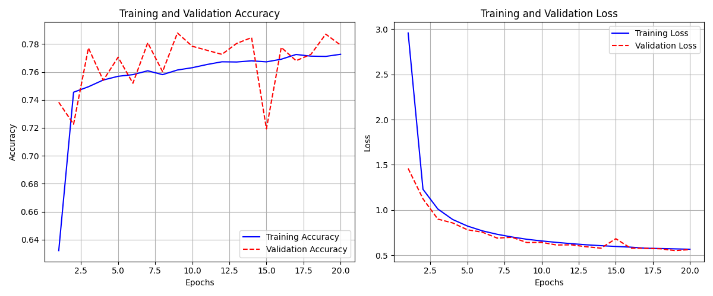
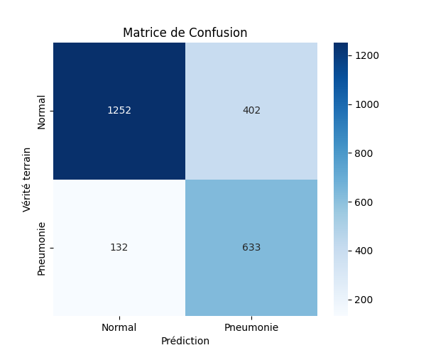

#  Pneumonia Detection Web App with Deep Learning

La pneumonie est une infection pulmonaire fréquente et potentiellement mortelle, touchant des millions de personnes à travers le monde. Une détection précoce et un traitement rapide sont essentiels pour une prise en charge efficace de cette maladie. L’intelligence artificielle (IA) et le machine learning (apprentissage automatique) offrent aujourd’hui des perspectives prometteuses pour améliorer la précision et la rapidité des diagnostics médicaux, notamment dans la détection de la pneumonie. Dans le cadre de ce projet, nous explorons l’utilisation de techniques d’IA et de machine learning pour détecter la pneumonie à partir d’images de radiographies thoraciques. En développant un modèle de détection de la pneumonie, notre objectif est d’aider les professionnels de santé à poser un diagnostic fiable et rapide, contribuant ainsi à améliorer les résultats cliniques et à sauver des vies.

Ce projet est une application web complète (Front-end + Back-end) conçue pour détecter la **pneumonie** à partir d’images médicales de type radiographie pulmonaire (chest X-rays). Il intègre deux modèles d'intelligence artificielle :

1. **Vérification de l’image** : Vérifie si l’image soumise est bien une radiographie thoracique ou non (filtrage d’images hors-contexte).
2. **Détection de la pneumonie** : Classifie les radiographies valides en trois catégories :
   - `Pneumonia (Lung Opacity)`
   - `Not-Pneumonia (Normal/No Lung Opacity)`

---

## Modèles d'IA utilisés

### 1. Modèle de Vérification (image médicale ou non)
- **But** : Rejeter les images non médicales ou hors-contexte.
- **Dataset** : ~2000 images (radiographies vs. images aléatoires)
- **Architecture** : CNN personnalisé
- **Format du modèle** : `logistic_model_weights.npz`

### 2. Modèle de Détection de Pneumonie
- **But** : Classifier les radiographies thoraciques.
- **Dataset** : RSNA Pneumonia Detection (~30 000 images)
- **Architecture** : VGG-like CNN (VGGV2 ou personnalisé)
- **Format du modèle** : `my_model_vggv2.h5`

---

## Fonctionnalités

-  Détection automatique du type d’image
-  Classification médicale avec score de confiance
-  Visualisation des zones activées via **Grad-CAM++**
-  Génération d’un rapport PDF d’analyse
-  Application Web moderne avec Vue.js

---

## Structure du projet
Pneumonia_Project/
- │
- ├── src/
- │ ├── Front-End/ # Interface utilisateur Vue.js
- │ ├── Back-End/ # API Flask avec les modèles
- |
- ├── my_notebook/ # Fonctions ML/IA, CAM, utils
- │
- ├── models/
- │ ├── logistic_model_weights.npz
- │ └── my_model_vggv2.h5
- │
- ├── data/ # Datasets utilisés
- │ ├── RSNA/
- │ └── Verification_data/
- |
- ├── output/  #the results
- |
- ├── requirements.txt
- ├── envirenement.yml
- └── README.md

## Resultat d'entraînement du model de détection

## Contact
 1. El Fajri Youssef : **elfajri.youssef@etu.uae.ac.ma**
 2. El Ayddouni Assaad: **asseadaydouni051@gmail.com**
 3. El Amrani Alae: **elamrani.alae@etu.uae.ac.ma**
 4. Zentari Abdrahman **zentariabderahman05@gmail.com**
